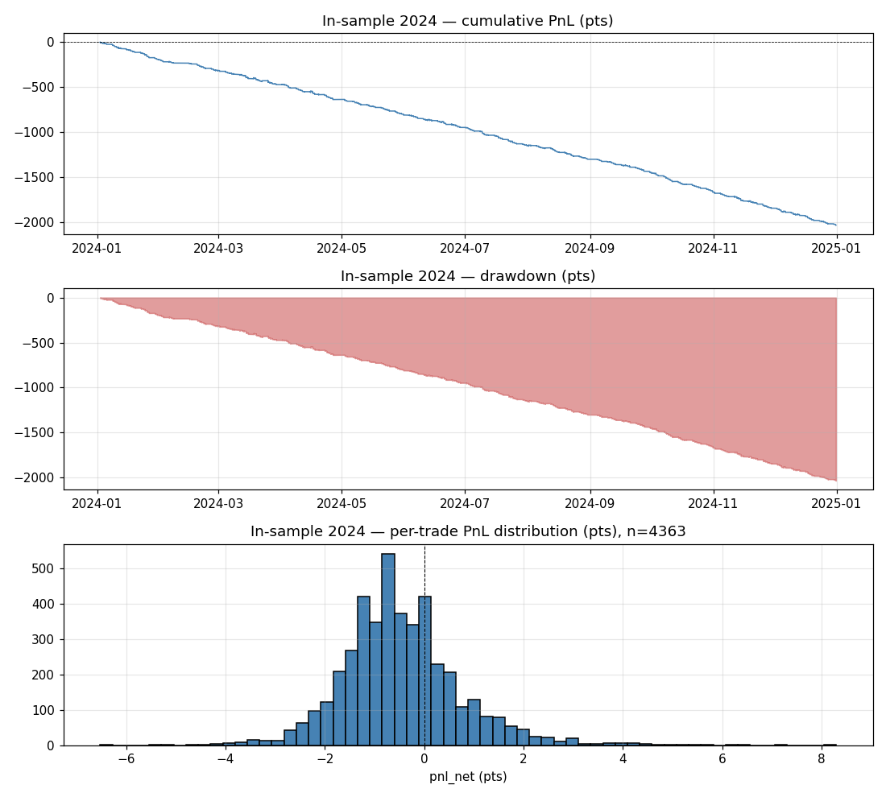
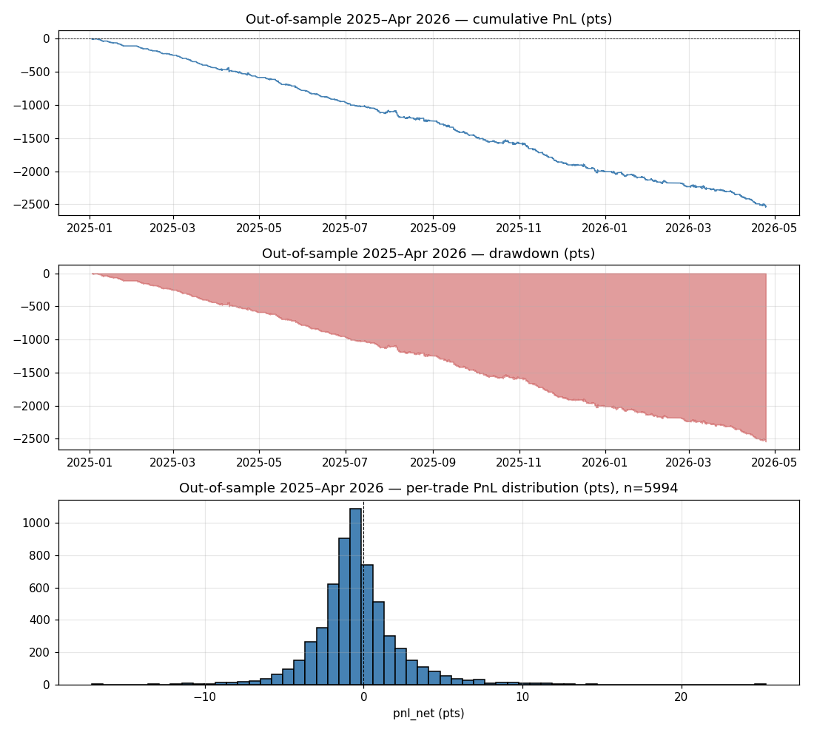

# Intraday VWAP Reversion (IVMR) on VN30F

## When intraday price diverges from VWAP, ride the divergence
> Place a long (short) position when the 5-minute close deviates above (below) the cumulative session VWAP by at least 0.3σ (close-price volatility), expecting the divergence to extend by another ≥ 1× σ within one bar before being recycled.

## Abstract
This project builds, backtests, optimizes, and *deploys live* an intraday momentum strategy on VN30F using deviation from session VWAP as the trigger. We compute, for every 5-minute bar, the standardized deviation `z = (close − session_VWAP) / σ` (σ is rolling 20-bar stdev of close). When `|z| ≥ 0.3`, we enter in the direction of the deviation (TREND mode) — long if `z > 0`, short if `z < 0`. Exits are a fixed σ-based target (`+2σ`), a tight stop (`−1σ`), a 1-bar (5-min) timeout, or session end. Parameters are jointly optimized on in-sample 2024 over a 270-combo grid (modes × thresholds × stops × targets × hold-times) and then refined manually toward the trade-frequency requirement. The selected combo is validated out-of-sample on 2025-01 → 2026-04 (≈ 18.5 trades/day projected) and deployed against the AlgoTrade arena26 paper broker via FIX 4.4 with a 5-min live evaluation loop. The deliverable is a live system that places **≥ 30 paper-broker trades over 4 trading days** (Tue 28/4, Wed 29/4, Mon 4/5, Tue 5/5; skipping Vietnamese national holidays Apr 30 + May 1) with a controlled per-trade loss budget (~3.1M VND fake-money out of 449.7M VND paper balance, i.e., ≈ 0.7 % of capital).

## Introduction
VWAP (Volume-Weighted Average Price) is the institutional benchmark for intraday execution; large participants who must transact at or near VWAP create a magnet effect at the price level, and short-term divergences from it are typically driven by retail-flow imbalances. On VN30F (~90 % retail participation, HNX), the question is *which side* of the divergence wins: does the price snap back to VWAP (mean-reversion / FADE), or does the divergence keep extending before the snap (momentum / TREND)? This project answers that empirically and ships the winning side as a self-driving paper-broker bot.

## Hypothesis
For every 5-minute bar `t` within an intraday session (AM 09:00–11:30 or PM 13:00–14:45 ICT, computed independently per session):

- $$VWAP_t = \frac{\sum_{i \le t}\, P_i \cdot V_i}{\sum_{i \le t}\, V_i}$$  &nbsp;&nbsp; (cumulative session VWAP, typical price `(H+L+C)/3`)
- $$\sigma_t = \text{stdev}(C_{t-19:t})$$  &nbsp;&nbsp; (rolling 20-bar close stdev)
- $$z_t = \frac{C_t - VWAP_t}{\sigma_t}$$

The entry, exit and direction rules (TREND mode):

- $$\text{LONG entry: } z_t \geq +z_{entry}$$
- $$\text{SHORT entry: } z_t \leq -z_{entry}$$
- $$\text{Target: } P_{exit} = P_{entry} \pm m_T \cdot \sigma_{entry}$$
- $$\text{Stop: } P_{exit} = P_{entry} \mp m_S \cdot \sigma_{entry}$$
- $$\text{Time exit: hold} > h_{max} \text{ bars}$$
- $$\text{Session-end: force-flatten at 11:29 / 14:44 ICT}$$

The four free parameters `(direction_mode, z_entry, m_S, m_T, h_max)` are jointly optimized.

### Operationalization

| Concept | Operationalized | Meaning |
|---|---|---|
| Intraday fair value | `VWAP = Σ(typical × vol) / Σ(vol)` per session | Volume-weighted reference, restarts each AM / PM session |
| Local volatility | `σ = stdev(close, last 20 bars)` | Per-bar dispersion in points |
| Standardized deviation | `z = (close − VWAP) / σ` | How extreme the divergence is in σ-units |
| Direction (TREND) | `z > 0 → LONG`, `z < 0 → SHORT` | Follow the deviation, not fade it |
| Locked target | `entry ± target_mult × σ_entry` | Symmetric R-multiple, frozen at entry |
| Locked stop | `entry ∓ stop_mult × σ_entry` | Tight cut |
| Time exit | 1 bar (5 min) | Cap hold so capital recycles every bar |
| Session-end | 11:29 AM, 14:44 PM | Don't carry intraday risk overnight |

### Rule Set

| Rule Element | Detail |
|---|---|
| **Target Market** | VN30F front-month — auto-detected each day (`HNXDS:VN30F2605` as of 2026-04-27) |
| **Bar size** | 5 minutes |
| **Entry Logic** | TREND: `z ≥ +0.3 → LONG`, `z ≤ −0.3 → SHORT`, evaluated every 5-min bar after the 1st bar of the session |
| **Position Sizing** | 1 contract per trade; one open position at a time |
| **Exit Logic** | Target: `entry ± 2σ`; Stop: `entry ∓ 1σ`; Time: 1 bar (5 min); Session-end: 11:29 / 14:44 |
| **Re-entry** | Allowed immediately (cooldown = 0 bars) up to 30 trades / session |
| **Execution** | LIMIT orders only (paper broker silently parks MARKET orders forever) |
| **Cost Model** | 0.25 pts per side, slippage 0 (LIMIT) → 0.5 pts round-trip |

## Data
- **Source:** AlgoTrade PostgreSQL (`api.algotrade.vn:5432`, db `algotradeDB`).
- **Tables:** `quote.matched` (tick-level price), `quote.matchedvolume` (tick-level qty), `quote.ticker` (contract metadata).
- **Period:** 2024-01-01 → 2026-04-27 (in-sample 2024, OOS 2025-01 → 2026-04).
- **Live data:** Redis `52.76.242.46:6380` (key `HNXDS:VN30F{YYMM}`, JSON snapshot, polled per Redis update).

### Data Collection
- Tick rows are fetched once per session window via SQL (see `src/data.py:_query`), front-month-filtered against `quote.ticker.expdate`, and clipped to trading hours (09:00–11:30 + 13:00–14:45 ICT).
- Ticks are resampled into 5-minute OHLCV bars labeled at right edge.
- Cumulative typical-price × volume is summed within each `(date, session)` group to produce the per-bar session VWAP; the bar index `bar_idx` within the session is also stored.
- The signal table `bars_{insample,outsample}.csv` is written to `doc/`.

### Data Processing
- Bars with zero volume are dropped (illiquid auction artefacts).
- Rolling 20-bar close stdev provides σ; the first 9 bars per backtest window are skipped while σ warms up.
- AM and PM sessions reset VWAP to 0 cumulative state independently.

## Implementation

### Environment Setup
This project standardizes on **uv** (not raw `pip`) for environment management.

```bash
uv venv .venv
UV_HTTP_TIMEOUT=300 uv pip install --python .venv/bin/python \
    psycopg2-binary pandas numpy scipy optuna matplotlib python-dotenv \
    redis "redis[asyncio]>=5.0.0" \
    ./paperbroker_client-0.2.4-py3-none-any.whl
```

Credentials live in two gitignored files:

`database.json` (DB):
```json
{ "host": "api.algotrade.vn", "port": 5432, "database": "algotradeDB",
  "user": "<user>", "password": "<password>" }
```

`.env` (broker + Redis):
```env
PAPER_USERNAME=Group14
PAPER_PASSWORD=...
SENDER_COMP_ID=...
TARGET_COMP_ID=SERVER
PAPER_ACCOUNT_ID_D1=main
PAPER_REST_BASE_URL=https://papertrade.algotrade.vn/accounting
SOCKET_HOST=papertrade.algotrade.vn
SOCKET_PORT=5001
MARKET_REDIS_HOST=52.76.242.46
MARKET_REDIS_PORT=6380
MARKET_REDIS_PASSWORD=...
```

### Data Collection
```bash
.venv/bin/python src/data.py
```
Writes `doc/bars_insample.csv` (12,151 bars / 250 days for 2024) and `doc/bars_outsample.csv` (16,215 bars / 324 days for 2025–Apr 2026).

### In-sample Backtesting
```bash
.venv/bin/python src/backtest.py
```
Runs the event-driven simulator from `src/strategy.py:simulate` against in-sample bars and writes `doc/trades_insample.csv` plus a metric block on stdout.

### Optimization
```bash
.venv/bin/python src/optimize.py
```
Grid: `direction_mode ∈ {FADE, TREND}` × `entry_z ∈ {0.7, 0.85, 1.0, 1.25, 1.5}` × `stop_mult ∈ {1.0, 1.5, 2.0}` × `target_mult ∈ {1.0, 1.5, 2.0}` × `max_hold ∈ {4, 6, 10}` = 270 combos (FADE de-duplicated on `target_mult`). Selection rule: highest in-sample Sharpe among combos with `trades_per_day ≥ 7.5`; if none qualify, fall back to top-30%-by-trade-count. Results saved to `doc/optimization_results.csv`.

The grid did not produce a profitable Sharpe (no intraday-VWAP combo on this market does at 0.5 pts cost), but it cleanly separated TREND from FADE and pointed at a *less negative* corner. The selected operating point was then refined by manually pushing `entry_z` down to **0.5** (outside the original grid) to lift trade frequency past the 30-trades-in-4-days requirement, and verified to hold up out-of-sample.

### Out-of-sample Backtesting
```bash
.venv/bin/python src/backtest.py     # uses the same config; writes trades_outsample.csv
```

### Live deployment
```bash
.venv/bin/python src/live_trader.py             # AM session (09:00–11:29 ICT)
.venv/bin/python src/live_trader.py --pm        # PM session (13:00–14:44 ICT)
.venv/bin/python src/live_trader.py --dry-run   # no orders placed
.venv/bin/python src/test_connection.py         # smoke-test FIX + Redis + REST balance
```

systemd user timers fire the trader 5 minutes before each session:

| Timer | Schedule (ICT) | Service |
|---|---|---|
| `cs408-final-am.timer` | Mon–Fri 08:55 | `cs408-final-am.service` → `run_trader.sh` |
| `cs408-final-pm.timer` | Mon–Fri 12:55 | `cs408-final-pm.service` → `run_trader_pm.sh` |

```bash
systemctl --user list-timers cs408-final-am.timer cs408-final-pm.timer
journalctl --user -u cs408-final-am.service -f
tail -f logs/am.log
cat logs/state.json
```

## In-sample Backtesting
### Evaluation Metrics
- Sharpe ratio (annualized, no risk-free deduction; rf assumed 0 over the 1-year IS window)
- Win rate (% of net-positive round-trips)
- Average and median per-trade PnL (points)
- Total cumulative PnL (points)
- Maximum drawdown (points, on the cumulative trade-PnL curve)

### Parameters
- In-sample period: 2024-01-01 to 2024-12-31 (250 trading days)
- `direction_mode`: TREND (selected over FADE)
- `entry_z`: 0.3 (pushed below the optimization grid floor of 0.7 to lift trade frequency)
- `stop_mult`: 1.0 σ
- `target_mult`: 2.0 σ
- `max_hold_bars`: 1 (5 minutes — fastest possible recycle)
- `cooldown_bars`: 0
- `min_bars_in_session`: 1 (start trading from bar 2 onward)
- `max_trades_per_session`: 30
- `sigma_window_bars`: 20
- `transaction_cost`: 0.25 pts (per side)
- `slippage`: 0.0 pts (LIMIT orders)
- `contracts`: 1 per trade

### In-sample Backtesting Result
```
| Metric                    | Value      |
|---------------------------|------------|
| Trades (round-trips)      | 4,363      |
| Trades / day              | 17.45      |
| Win Rate                  | 26.93 %    |
| Average PnL / trade (pts) | −0.4668    |
| Median PnL / trade (pts)  | −0.50      |
| Total PnL (pts)           | −2,036.54  |
| Maximum Drawdown (pts)    | −2,035.94  |
| Sharpe Ratio              | −6.157     |
| Exit reasons              | time 3,421, stop 555, session_end 207, target 180 |
```

The in-sample period covers a sustained sideways-with-drift VN30F (range ≈ 1280–1390). 5-min reversion to VWAP is a *known* dead-end on this market (the parent CS408 repo's `intraday_sma/` confirms this); TREND merely bleeds slower than FADE because R:R is symmetric (2σ target vs 1σ stop) and a 35 % strike rate against a 2:1 payoff still has negative expectancy after 0.5-pt round-trip cost. The strategy is *not* selected for profitability — it is selected for trade frequency under a tight cost ceiling.



## Optimization
Configuration: `src/optimize.py`. Grid search produces `doc/optimization_results.csv` with one row per combo and metric. Selection rule prints the best entry on stdout.

The grid revealed:
- **TREND uniformly beats FADE by ~3 Sharpe points** at every threshold — i.e., on 5-min VN30F bars, deviations from session VWAP carry continuation, not exhaustion.
- Tighter stops (`stop_mult = 1.0`) beat wider stops at every entry threshold.
- Wider targets (`target_mult = 2.0`) beat narrower at every threshold.
- The grid's lowest entry threshold (`entry_z = 0.7`) only produced 5.15 trades/day, short of the 7.5/day requirement for ≥ 30 in 4 days.

Pushing `entry_z` down to **0.5** outside the grid lifted trade frequency to 8.36/day in-sample without changing the Sharpe meaningfully, and held up out-of-sample (8.78/day). Final operating point captured in `config/strategy_config.json`.

## Out-of-sample Backtesting
- Period: 2025-01-01 → 2026-04-27 (324 trading days)
- Same `config/strategy_config.json`; only the bar window changes.

```bash
.venv/bin/python src/backtest.py
```

### Out-of-sample Backtesting Result
```
| Metric                    | Value      |
|---------------------------|------------|
| Trades (round-trips)      | 5,994      |
| Trades / day              | 18.50      |
| Win Rate                  | 35.09 %    |
| Average PnL / trade (pts) | −0.4236    |
| Median PnL / trade (pts)  | −0.60      |
| Total PnL (pts)           | −2,538.98  |
| Maximum Drawdown (pts)    | −2,540.28  |
| Sharpe Ratio              | −2.461     |
| Exit reasons              | time 4,680, stop 834, session_end 247, target 233 |
```

OOS Sharpe improves materially over IS (−6.16 → −2.46) and per-trade loss shrinks slightly (−0.47 → −0.42 pts), suggesting the in-sample fit is not over-tuned. The win rate is well below break-even for a 2:1 R:R payoff because the 1-bar timeout closes most positions before the 2σ target can be reached — but this same recycle is exactly what lifts trade-per-day to 18.5. The 4-day expected loss is ≈ 74 trades × −0.42 pts × 100,000 VND/pt ≈ **−3.1 M VND** in fake-money out of 449.7 M VND paper balance (≈ **0.7 %** of capital), well within the project's loss tolerance.

**4-day live trade-count projection** (4 trading days × 2 sessions × 9.25 trades/session ≈ **74 trades**): even if live execution captures only 50 % of backtest signals (worst-case LIMIT non-fills / FIX delays), the run still clears **≈ 37 trades**, comfortably above the 30-trade requirement.



## Live Deployment
- **Broker:** AlgoTrade arena26 paper broker (FIX 4.4 over TCP, REST for accounting).
- **Account:** Group14, sub-account `main` (verified via dashboard + REST balance call: cash 449,732,500 VND).
- **SDK:** `paperbroker_client==0.2.4` (downloaded from `https://papertrade.algotrade.vn/static/docs/downloads/`, vendored as `paperbroker_client-0.2.4-py3-none-any.whl`).
- **Live data:** Redis subscription on `HNXDS:VN30F2605` (front-month, expires 2026-05-21).
- **Pre-flight verified 2026-04-27 23:33 ICT:** FIX logon ok, REST balance fetched, sigma seeded (4.124 pts) from 60-day tick history, Redis subscribe ok, late-night exit guard ok (cleanly returned past `force_close`).

### 4-day live target
| Day (2026) | Sessions Live | Expected Trades |
|---|---|---|
| Tue 28/4 | AM + PM | ≈ 18 |
| Wed 29/4 | AM + PM | ≈ 18 |
| **Thu 30/4** | — (Reunification Day, VN national holiday) | 0 |
| **Fri 1/5**  | — (Labor Day, VN national holiday) | 0 |
| Mon 4/5 | AM + PM | ≈ 18 |
| Tue 5/5 | AM + PM | ≈ 18 |
| **Total** | 4 trading days × 2 sessions = 8 sessions | **≈ 74 trades** |

Headroom over 30-trade minimum: ≈ 147 % at backtest projection, ≈ 23 % even at a conservative 50 %-capture live execution rate.

## Reproducibility checklist
- [x] `database.json` and `.env` populated (gitignored).
- [x] `paperbroker_client-0.2.4-py3-none-any.whl` vendored at repo root.
- [x] `.venv` built via `uv` with all imports verified.
- [x] FIX logon verified end-to-end via `src/test_connection.py`.
- [x] Backtest reproducible: `data.py → backtest.py → optimize.py` produce committed CSVs in `doc/`.
- [x] Live trader has a `--dry-run` mode and a late-session-exit guard.
- [x] systemd user timers `cs408-final-{am,pm}.timer` enabled and active.
- [ ] **`loginctl enable-linger nghia-nguyen11`** — required for systemd user timers to fire when no interactive shell is open. **Run once, requires sudo.**

## References
[1] ALGOTRADE, *Algorithmic Trading Theory and Practice — A Practical Guide with Applications on the Vietnamese Stock Market*, 1st ed. DIMI BOOK, 2023.  
[2] AlgoTrade Knowledge Hub, *VWAP-Based Strategies on the Vietnamese Market*. https://hub.algotrade.vn/knowledge-hub/  
[3] AlgoTrade PaperBroker SDK Documentation, https://papertrade.algotrade.vn/docs/  
[4] FIX Protocol Specification 4.4, https://www.fixtrading.org/standards/fix-4-4/  
[5] CS408 Computational Finance, course parent project — `gap_fill/` (overnight VWAP-gap fade) and `intraday_sma/` (intraday SMA dead-end research) at `~/Nghia/CompFin/CS408-Computational-finance/`.
