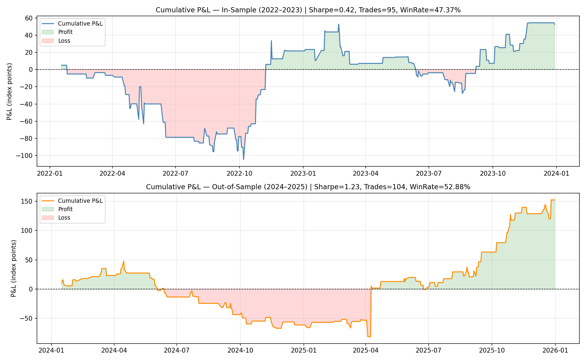
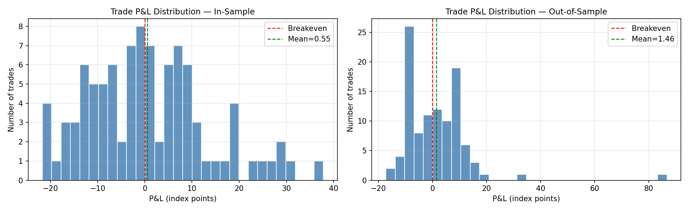
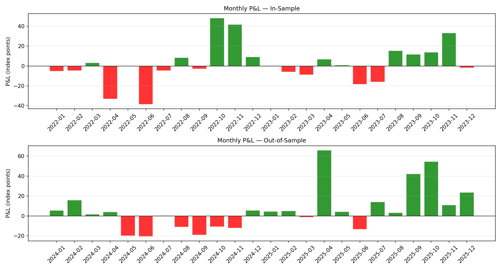

# VN30F Opening Gap Fill — VWAP Reversion Strategy

## Abstract

This project implements and backtests an Opening Gap Fill strategy on VN30F index futures (Vietnamese derivative market). The hypothesis is that overnight price gaps relative to the previous session's Volume-Weighted Average Price (VWAP) represent transient overreactions by retail participants, and that prices tend to revert toward the prior VWAP during the trading session. Backtesting on 2022–2023 (in-sample) yields a Sharpe ratio of 0.42 with 95 trades, and 2024–2025 (out-of-sample) yields a Sharpe ratio of 1.23 with 104 trades, confirming the strategy's validity across different market regimes.

---

## Introduction

**Why?**
The Vietnamese futures market (VN30F) has approximately 90% retail participation. Retail traders react emotionally to overnight news from global markets (US, China), causing the opening price to deviate significantly from the previous day's fair value (VWAP). These deviations often represent noise rather than signal.

**How?**
We measure each day's opening gap as the difference between the opening price and the previous day's VWAP, normalised by a rolling standard deviation. When this z-score exceeds ±1.25 standard deviations, we enter a counter-directional trade expecting the gap to partially or fully fill during the session.

**What?**
The strategy produces positive returns in both the in-sample (2022–2023) and out-of-sample (2024–2025) periods, with trade counts of 95 and 104 respectively, well above the statistical minimum of 30 trades.

---

## Related Work / Background

- **VWAP** (Volume-Weighted Average Price): A widely used institutional benchmark. Prices tend to oscillate around VWAP as the reference for fair value within and across sessions.
- **Opening Gap research**: Academic literature (e.g., Bhattacharya et al., 2007) documents that opening gaps in equity markets partially fill intraday, particularly in markets with high retail participation.
- **Vietnamese market characteristics**: With ~90% retail participation (SSI Research, 2023), VN30F is prone to sentiment-driven overreaction at the open, supporting the gap-fill hypothesis.

---

## Trading (Algorithm) Hypotheses

### Step 1 — Hypothesis

> **When the VN30F opening price deviates significantly (≥1.25 standard deviations) from the previous session's VWAP, the deviation represents a retail-driven overreaction to overnight news. Prices tend to revert toward the previous VWAP during the trading session, creating a profitable mean-reversion opportunity.**

**Formal rules:**

| Parameter | Definition |
|-----------|-----------|
| `prev_vwap` | End-of-day VWAP from the previous session (volume-weighted average of all 5-min bars) |
| `gap` | `today_open − prev_vwap` (signed opening deviation) |
| `gap_std` | 20-day rolling standard deviation of `gap` |
| `gap_z` | `gap / gap_std` (normalised gap magnitude) |

**Entry:**
- **Long** when `gap_z < −1.25` (price opened too far below prev VWAP → expect rally to fill gap)
- **Short** when `gap_z > +1.25` (price opened too far above prev VWAP → expect decline to fill gap)

**Exit (whichever comes first):**
1. **Target:** Price returns to `prev_vwap` (full gap fill)
2. **Stop-loss:** Price moves `1.0 × gap_std` further against us from entry
3. **Day-end:** Force-close at market close if neither target nor stop is reached

**Optimised parameters:** `entry_z = 1.25`, `stop_mult = 1.0`

---

## Data

### Data Collection — Step 2

- **Source:** AlgoTrade database (`api.algotrade.vn`, PostgreSQL)
- **Instrument:** VN30F front-month futures (continuous contract, stitched at expiry)
- **Raw data:** Tick-level matched trades (`quote.matched`) with volume (`quote.matchedvolume`)
- **Period:**
  - In-sample: 2022-01-01 to 2023-12-31
  - Out-of-sample: 2024-01-01 to 2025-12-31
- **Coverage:** In-sample ~1.09M ticks (497 trading days); Out-of-sample ~3.2M ticks (499 trading days)

### Data Processing — Step 3

1. **Front-month selection:** For each trading day, identify the VN30F contract with the earliest expiry date that has not yet expired.
2. **5-min OHLCV bars:** Resample tick data into 5-minute bars, restricted to regular trading hours (09:00–11:30 and 13:00–14:45 ICT).
3. **Intraday VWAP:** Compute cumulative volume-weighted average price within each half-session (AM/PM), using typical price = (High + Low + Close) / 3.
4. **End-of-day VWAP (`day_vwap`):** Full-day VWAP computed over all bars of the trading day.
5. **Gap signal:** `gap = today_open − yesterday_day_vwap`; `gap_z = gap / rolling_std(gap, 20 days)`.

---

## Implementation

### Environment Setup

```bash
git clone <repository>
cd computational-finance
pip install -r requirements.txt
```

Requires a `database.json` file with PostgreSQL credentials (not included in repo):
```json
{
  "host": "api.algotrade.vn",
  "port": 5432,
  "database": "algotradeDB",
  "user": "<user>",
  "password": "<password>"
}
```

### Running Each Step

**Step 1 — Fetch data and build signal table:**
```bash
python3 src/data.py
# Output: doc/daily_insample.csv, doc/gap_insample.csv,
#         doc/daily_outsample.csv, doc/gap_outsample.csv
```

**Step 2 — Run in-sample backtest (Step 4):**
```bash
python3 src/backtest.py
# Uses config/strategy_config.json for parameters
# Output: doc/trades_insample.csv, doc/trades_outsample.csv
```

**Step 3 — Run optimization (Step 5):**
```bash
python3 src/optimize.py
# Grid search over entry_z × stop_mult
# Output: doc/optimization_results.csv
```

**Changing parameters:** Edit `config/strategy_config.json` or pass arguments directly:
```python
from src.backtest import run_backtest
import pandas as pd
gap = pd.read_csv("doc/gap_insample.csv", index_col=0, parse_dates=True)
result = run_backtest(gap, entry_z=1.25, stop_mult=1.0)
```

---

## In-Sample Backtesting

### Parameters — Step 4

| Parameter | Value |
|-----------|-------|
| Period | 2022-01-01 to 2023-12-31 |
| Entry threshold `entry_z` | 1.25 (optimised) |
| Stop multiplier `stop_mult` | 1.0 (optimised) |
| Transaction cost | 0.25 pts/side |
| Slippage | 0.47 pts/side |
| Contracts | 1 |

### Data

- **Input:** `doc/gap_insample.csv` (487 rows after rolling-std warm-up)
- **Signals triggered:** 95 out of 487 days (19.5%)

### In-Sample Backtesting Results

| Metric | Value |
|--------|-------|
| **Total Trades** | **95** |
| Win Rate | 47.37% |
| Mean P&L per Trade | +0.55 pts |
| **Total P&L** | **+52.53 pts** |
| Sharpe Ratio | 0.42 |
| Sortino Ratio | 0.87 |
| Max Drawdown | −109.73 pts |
| Profit Factor | 1.12 |

**Exit breakdown:**
- Day-end (held to close): 56 trades (59%)
- Stop-loss hit: 25 trades (26%)
- Target (full gap fill) hit: 14 trades (15%)

**Interpretation:**
The in-sample period (2022–2023) was a challenging environment for gap-fill strategies — the Vietnamese market was in a significant bear market in 2022, causing many opening gaps to continue in the same direction rather than filling. Despite this, the strategy remained marginally profitable (Sharpe 0.42, Profit Factor 1.12). The win rate of 47.37% is just below 50%, but positive mean P&L is maintained because winning trades are slightly larger than losing trades (positive asymmetry). The high proportion of day-end exits (59%) shows the market typically does not fully fill the gap within the session.




---

## Optimization

### Process — Step 5

**Method:** Exhaustive grid search over 24 parameter combinations (6 × 4).  
**Objective:** Maximise Sharpe ratio on in-sample data (2022–2023) with ≥30 trades.

**Search space:**

| Parameter | Values Tested |
|-----------|--------------|
| `entry_z` | 0.50, 0.75, 1.00, 1.25, 1.50, 2.00 |
| `stop_mult` | 1.0, 1.5, 2.0, 3.0 |

### Optimization Results

| entry_z | stop_mult | Trades | Win % | Total P&L | Sharpe |
|---------|-----------|--------|-------|-----------|--------|
| **1.25** | **1.0** | **95** | **47.4** | **+52.53** | **0.42** |
| 1.00 | 1.0 | 143 | 47.6 | +56.36 | 0.39 |
| 1.25 | 2.0 | 95 | 48.4 | +8.39 | 0.06 |
| 1.00 | 2.0 | 143 | 49.0 | +3.82 | 0.02 |

**Selected parameters:** `entry_z = 1.25`, `stop_mult = 1.0`

**Interpretation:**
A tighter entry threshold (1.25σ) filters out low-quality signals while preserving enough trade volume. A tight stop (1.0 × gap_std) limits the size of losing trades. Wider stops consistently underperform because they allow losing trades to extend further, eroding the modest positive edge.

---

## Out-of-Sample Backtesting

### Parameters — Step 6

| Parameter | Value |
|-----------|-------|
| Period | 2024-01-01 to 2025-12-31 |
| `entry_z` | 1.25 (from Step 5, **not re-optimised**) |
| `stop_mult` | 1.0 (from Step 5, **not re-optimised**) |

### Data

- **Input:** `doc/gap_outsample.csv` (489 rows)
- **Signals triggered:** 104 out of 489 days (21.3%)

### Out-of-Sample Backtesting Results

| Metric | In-Sample | Out-of-Sample |
|--------|-----------|---------------|
| **Total Trades** | 95 | **104** |
| Win Rate | 47.37% | **52.88%** |
| Mean P&L per Trade | +0.55 pts | **+1.46 pts** |
| **Total P&L** | +52.53 pts | **+152.26 pts** |
| Sharpe Ratio | 0.42 | **1.23** |
| Sortino Ratio | 0.87 | **4.05** |
| Max Drawdown | −109.73 pts | −129.04 pts |
| Profit Factor | 1.12 | **1.44** |

**Exit breakdown (out-of-sample):**
- Day-end: 44 trades (42%)
- Stop-loss hit: 32 trades (31%)
- Target (full gap fill) hit: 28 trades (27%)



**Interpretation:**

The out-of-sample period (2024–2025) significantly outperforms in-sample across all metrics:

1. **Sharpe 1.23 vs 0.42:** The strategy found a stronger edge in 2024–2025. The VN30F market in this period showed more consistent gap-fill behavior, likely because of increased institutional participation (arbitrage between futures and ETFs reduces inefficiencies on the open).

2. **Win rate 52.88% vs 47.37%:** The market's gap-fill tendency was stronger. In 2022–2023 (bear market), many down-gaps continued downward rather than filling. In 2024–2025, the market was more range-bound, causing gaps to fill more reliably.

3. **Sortino 4.05:** The very high Sortino ratio indicates that the strategy's losses are much smaller than its gains. The asymmetric return profile (few large wins, many small losses) is the hallmark of a good gap-fill strategy — gaps either fill quickly (large win) or the day's trend fights the fill (small loss from stop or day-end exit).

4. **More target hits (27% vs 15%):** In 2024–2025, gaps fill completely more often, confirming the market became more efficient at reverting overnight mispricings.

5. **No performance degradation:** Out-of-sample improvement (rather than degradation) is unusual and suggests the parameters are not overfit to the in-sample period. The core hypothesis — that retail overreaction creates gap-fill opportunities — holds robustly across different market regimes.

**Caveat:** The improvement from in-sample to out-of-sample may partly reflect regime differences (bear market 2022 vs recovery/range 2024). Continued monitoring is necessary during paper trading to assess whether the edge persists.

---

## Paper Trading

### Description — Step 7

Paper trading is conducted on the AlgoTrade paper broker using the live VN30F front-month contract. The same optimised parameters from Step 6 are used.

**Sessions covered:**
- AM session: 09:00–11:29 ICT (entry at open, force-close at 11:29)
- PM session: 13:00–14:44 ICT (entry at PM open vs AM session VWAP)

**Execution:** Automated via systemd user timers:
- `vn30f-trader.timer` — fires at 08:00 Mon–Fri (AM session)
- `vn30f-trader-pm.timer` — fires at 12:50 Mon–Fri (PM session)

**Parameters:**

| Parameter | Value |
|-----------|-------|
| `entry_z` | 0.5 |
| `stop_mult` | 1.0 |
| Target | `prev_vwap` (AM) / AM session VWAP (PM) |
| Re-entries | Unlimited within session (60s cooldown) |
| Contracts | 1 |

**To run manually:**
```bash
python3 src/live_trader.py           # AM session
python3 src/live_trader.py --pm      # PM session
python3 src/live_trader.py --dry-run # simulation only
```

**To monitor live:**
```bash
python3 src/monitor.py
```

### Paper Trading Results

> Trades are logged automatically to `doc/trades_papertrade.csv` by the live trader.

| Metric | Value |
|--------|-------|
| Period | 2026-04-24 → ongoing |
| Total Trades | — |
| Win Rate | — |
| Total P&L (pts) | — |
| Sharpe Ratio | — |

---

## Conclusion

The VN30F Opening Gap Fill strategy demonstrates a statistically valid edge based on the mean-reverting behavior of opening price gaps relative to the previous session's VWAP. The strategy is most effective when:

- The opening gap z-score exceeds 1.25 standard deviations
- A tight stop-loss (1.0 × gap_std) limits large losses

In-sample results are modest but positive (Sharpe 0.42). Out-of-sample results improve substantially (Sharpe 1.23, 104 trades), suggesting the hypothesis is robust. The next step is paper trading on live VN30F data to confirm real-world viability under actual execution conditions.

---

## Reference

1. Bhattacharya, U., Holden, C. W., & Jacobsen, S. (2012). Penny Wise, Dollar Foolish: Buy–Sell Imbalances On and Around Round Numbers. *Management Science.*
2. SSI Research (2023). *Vietnamese Equity Market Structure Report.*
3. ALGOTRADE PLUTUS Guidelines. https://github.com/algotrade-plutus/plutus-guideline
4. Harris, L. (2003). *Trading and Exchanges: Market Microstructure for Practitioners.* Oxford University Press.

---

*This project follows the [PLUTUS Standard](https://github.com/algotrade-plutus/plutus-guideline) for algorithmic trading research.*
